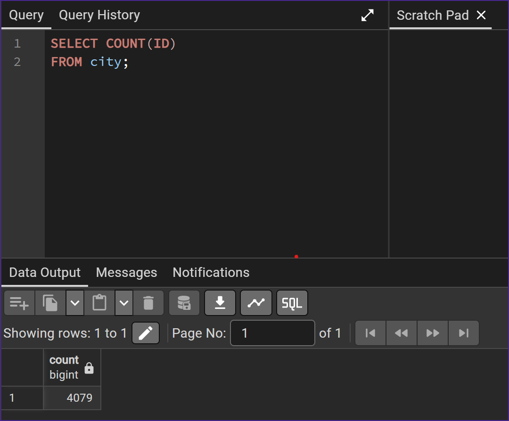
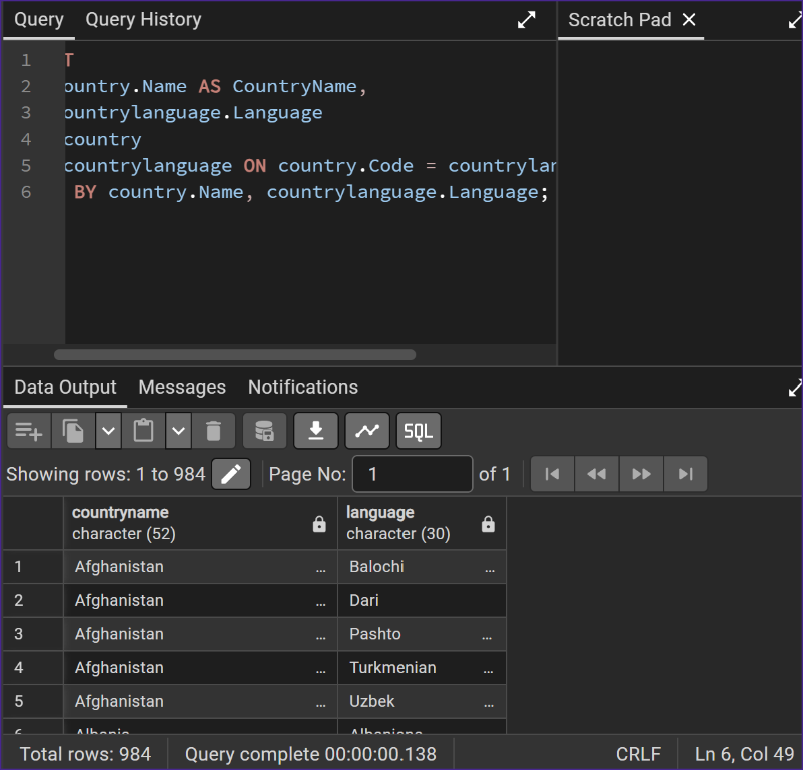
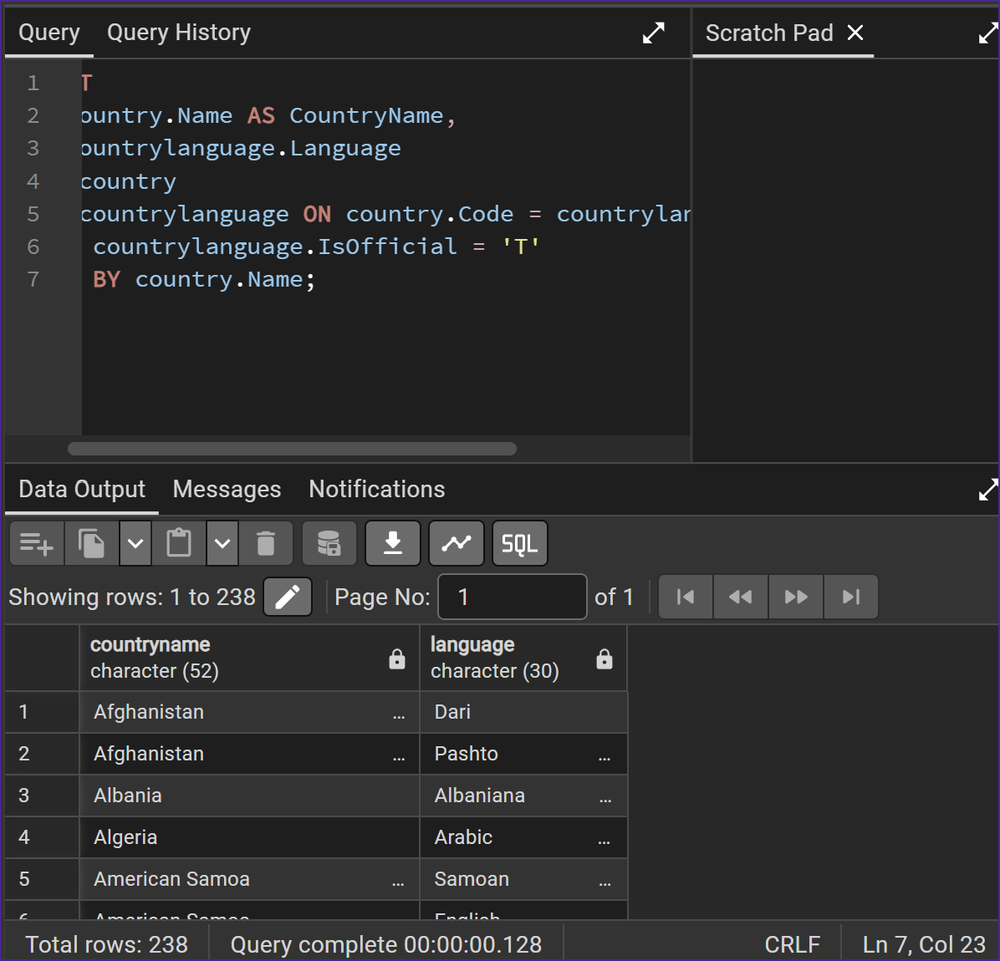
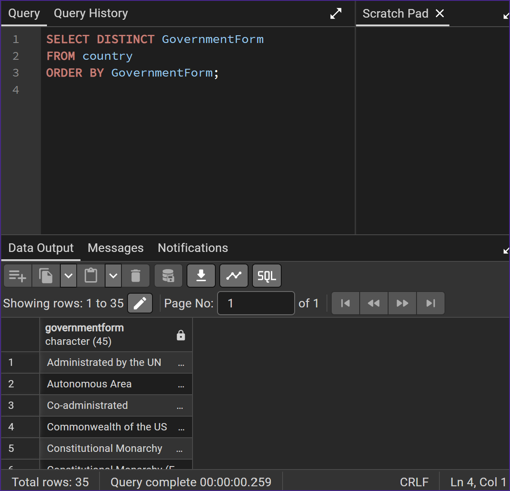
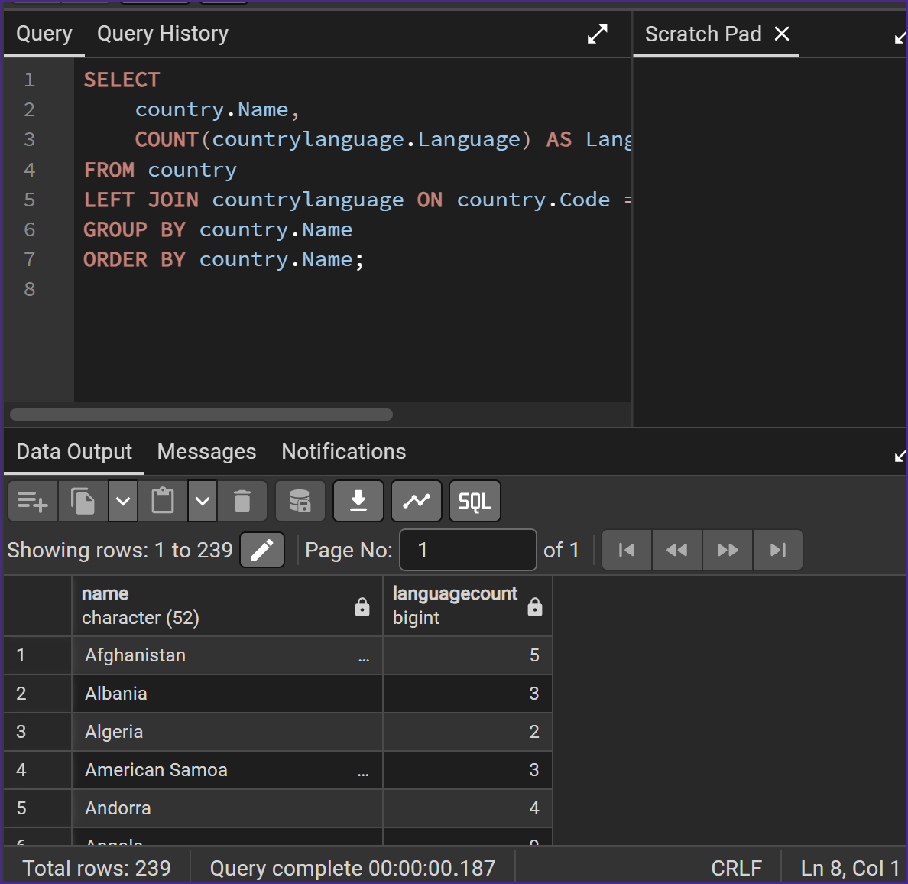
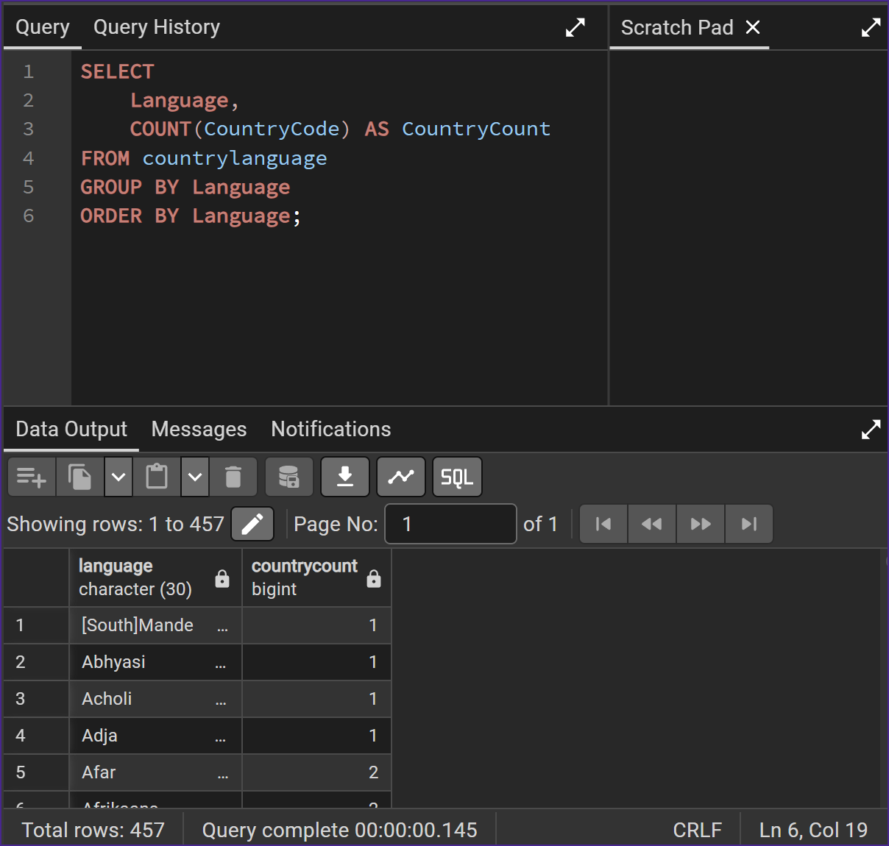
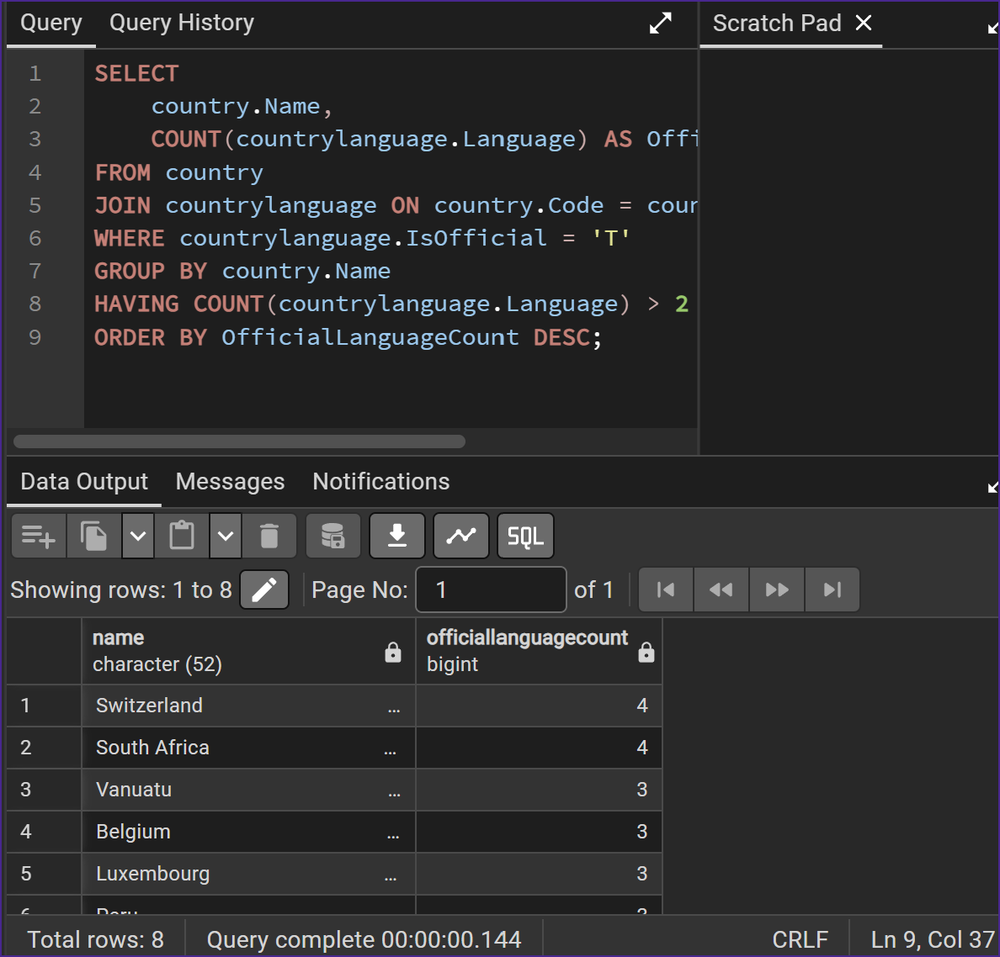
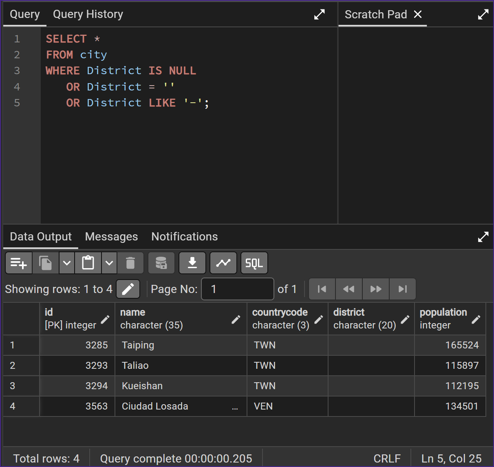
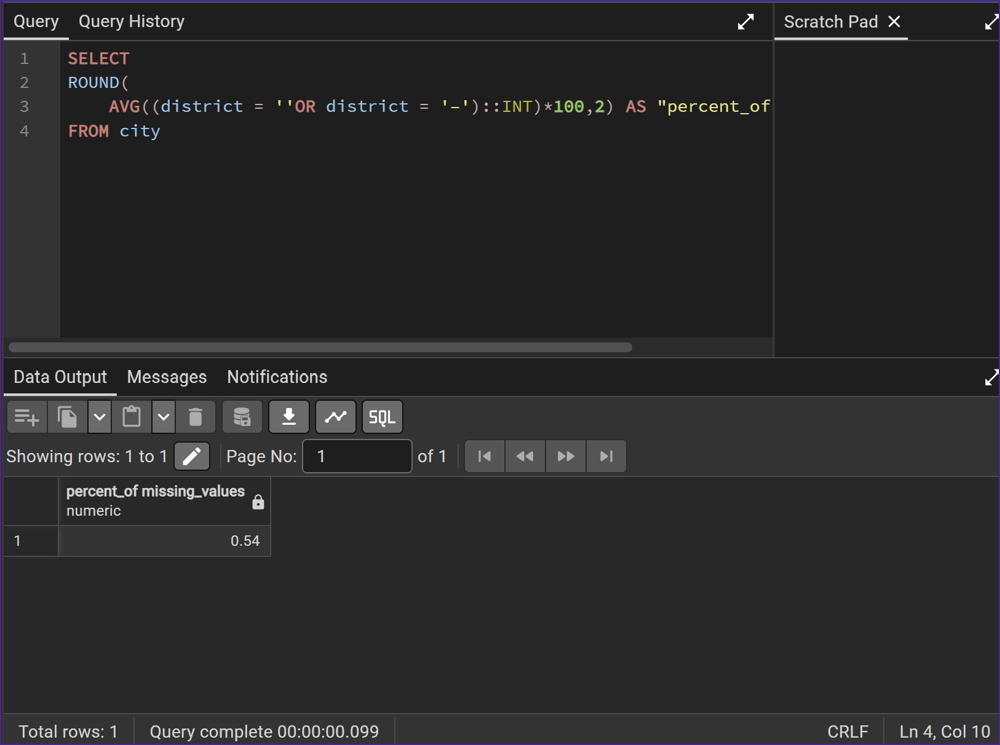

# Exercise 02: World Database – Joins, Grouping, and Data Quality

- Name: Jarred Gastreich
- Course: Database for Analytics
- Module: 2
- Database Used: World Database (PostgreSQL)

---

## Instructions

- Answer each question below using SQL executed against the **World database**.
- All SQL commands **must be run by you**.
- For each SQL-based question:
  - Include the SQL command in a fenced code block
  - Include a **screenshot** showing the command and its results
- Store screenshots in the `screenshots/` folder and embed them below each answer.

---

## Question 1

When importing records from `worldPGSQL.sql`, **how many cities were imported**?

### Answer
4079

### Screenshot
_Show evidence of how you determined this (for example, a COUNT query)._

```sql
SELECT COUNT(ID)
FROM city;
```



---

## Question 2

Using the World database, write the SQL command to **display each country name along with the name of each language spoken in that country**.

### SQL

```sql
SELECT
    country.Name AS CountryName,
    countrylanguage.Language
FROM country
JOIN countrylanguage ON country.Code = countrylanguage.CountryCode
ORDER BY country.Name, countrylanguage.Language;
```

### Screenshot



---

## Question 3

Using the World database, write the SQL command to **display each country name along with the name of each official language spoken in that country**.

### SQL

```sql
SELECT
    country.Name AS CountryName,
    countrylanguage.Language
FROM country
JOIN countrylanguage ON country.Code = countrylanguage.CountryCode
WHERE countrylanguage.IsOfficial = 'T'
ORDER BY country.Name;
```

### Screenshot



---

## Question 4

Consider the following two SQL statements:

```sql
SELECT *
FROM country, countrylanguage
WHERE country.code = countrylanguage.countrycode;
```

```sql
SELECT *
FROM country
LEFT OUTER JOIN countrylanguage
ON country.code = countrylanguage.countrycode;
```

**In your own words**, describe what data the **second query returns that the first query does not**.

### Answer
The LEFT OUTER JOIN query will return countries that have no languages associated with the row, while the other query will no display those countries.

---

## Question 5

Using the World database, write the SQL command to **list all different forms of government** found in the data.
Do **not** repeat any form of government more than once.

### SQL

```sql
SELECT DISTINCT GovernmentForm
FROM country
ORDER BY GovernmentForm;

```

### Screenshot


---

## Question 6

Using the World database, write the SQL command to **list all names of cities and countries in one column**.
Label the column **"City or Country Name"**.

### SQL

```sql
SELECT Name AS "City or Country Name"
FROM city
UNION
SELECT Name
FROM country
ORDER BY "City or Country Name";
```

### Screenshot



---

## Question 7

Using the World database, write the SQL command to **list all countries by name**, along with the **number of languages spoken in each country**.
Be sure to **sort by country name**.

### SQL

```sql
SELECT
    country.Name,
    COUNT(countrylanguage.Language) AS LanguageCount
FROM country
LEFT JOIN countrylanguage ON country.Code = countrylanguage.CountryCode
GROUP BY country.Name
ORDER BY country.Name;
```

### Screenshot



---

## Question 8

Using the World database, write the SQL command to **list all languages**, along with the **number of countries where each language is spoken**.
Be sure to **sort by language name**.

### SQL

```sql
SELECT
    Language,
    COUNT(CountryCode) AS CountryCount
FROM countrylanguage
GROUP BY Language
ORDER BY Language;
```

### Screenshot



---

## Question 9

Using the World database, write the SQL command to **list countries that have more than two official languages**, along with the **number of official languages spoken**.

*Hint: There are 8 such countries in this dataset.*

### SQL

```sql
SELECT
    country.Name,
    COUNT(countrylanguage.Language) AS OfficialLanguageCount
FROM country
JOIN countrylanguage ON country.Code = countrylanguage.CountryCode
WHERE countrylanguage.IsOfficial = 'T'
GROUP BY country.Name
HAVING COUNT(countrylanguage.Language) > 2
ORDER BY OfficialLanguageCount DESC;
```

### Screenshot



---

## Question 10

Using the World database, write the SQL command to **find cities where the district value is missing**.

*Hint: Use `LIKE` and the dash (`-`) since some rows use that instead of actual data.*

### SQL

```sql
SELECT *
FROM city
WHERE District IS NULL
   OR District = ''
   OR District LIKE '-';
```

### Screenshot



---

## Question 11

Using the World database, write the SQL command to **calculate the percentage of cities with missing district values**.

*Hint: The result should be approximately 0.4%.*

### SQL

```sql
SELECT
ROUND(
	AVG((district = ''OR district = '–')::INT)*100,2) AS "percent_of missing_values"
FROM city
```

### Screenshot


