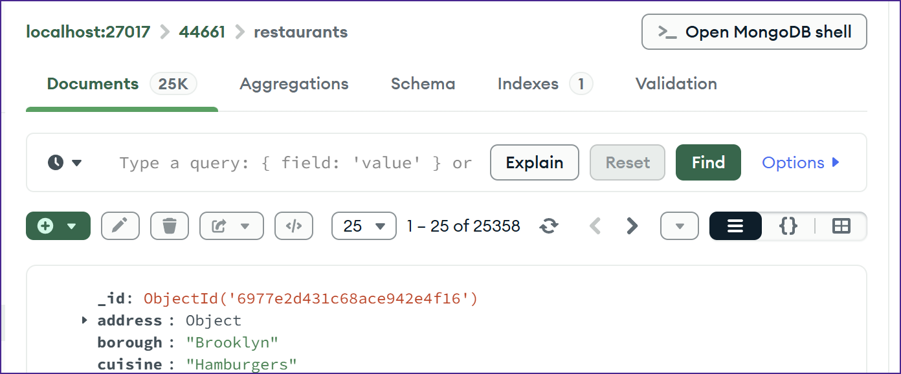
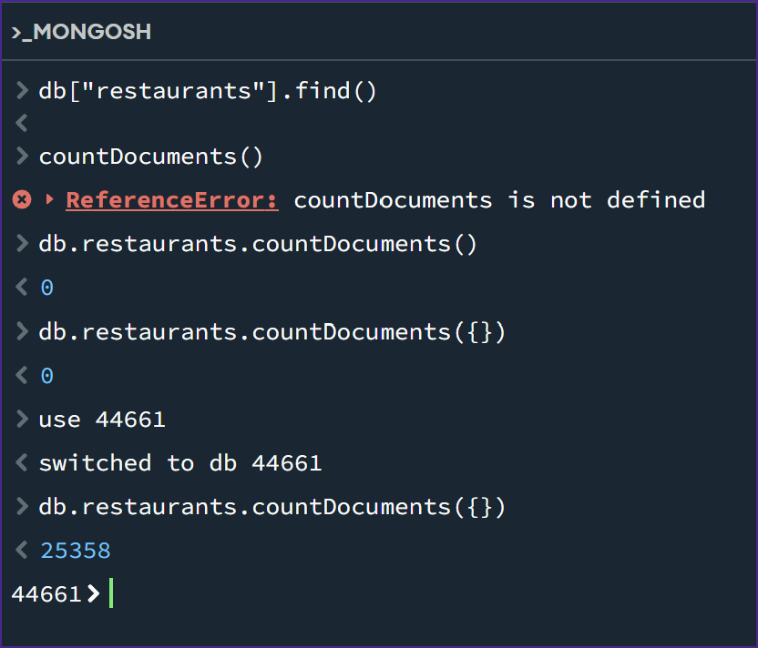
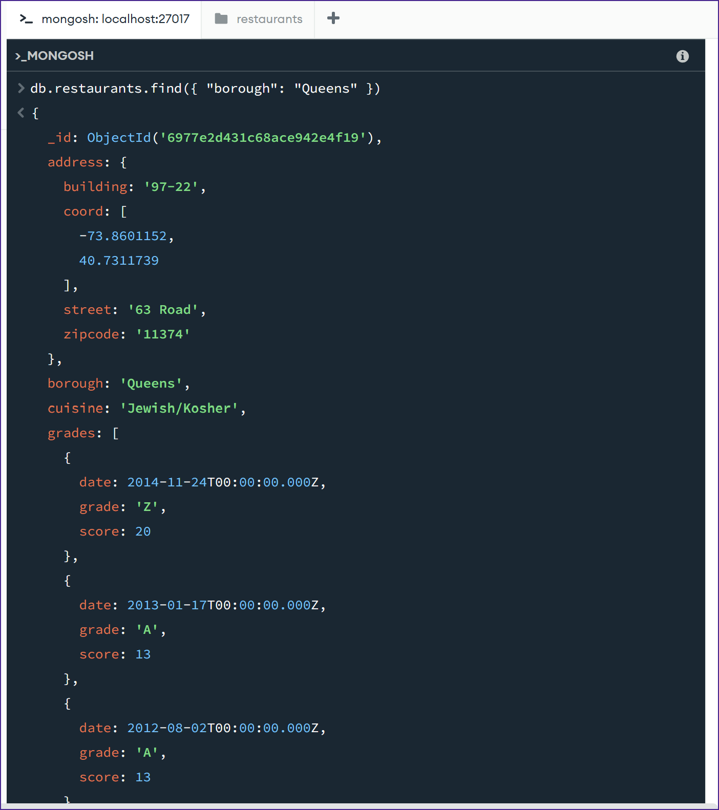
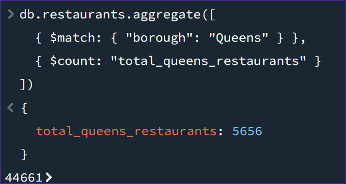
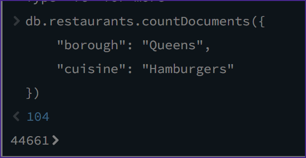
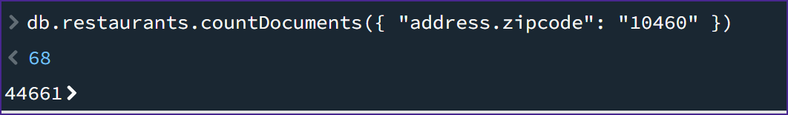
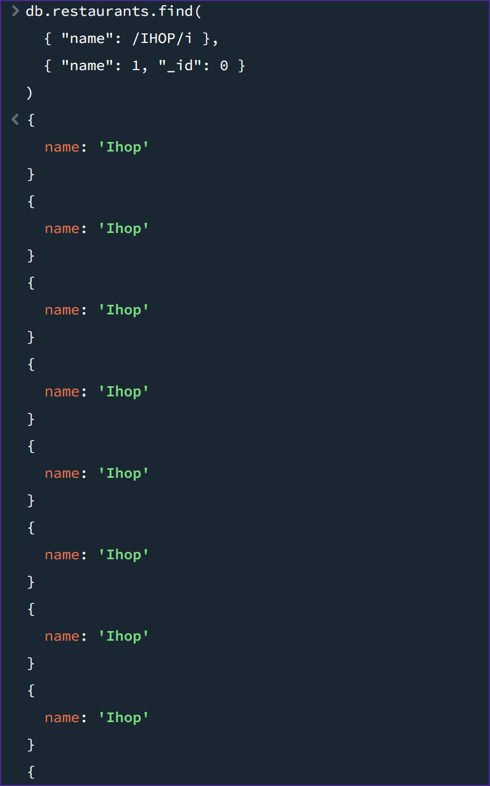

# Exercise 03: MongoDB – Document Queries and Analysis

- Name: Jarred Gastreich
- Course: Database for Analytics
- Module: 3
- Database Used: MongoDB
- Dataset: `restaurants-json.json`

---

## Instructions

- Import the provided `restaurants-json.json` file into MongoDB.
- All commands must be **executed by you** in the MongoDB shell or MongoDB Compass.
- For each query:
  - Include the MongoDB command in a fenced code block
  - Include a **screenshot** showing the command and its result
- Store screenshots in the `screenshots/` folder and embed them below each answer.

---

## Question 1

When importing the documents from `restaurants-json.json`, **how many documents were imported into your collection**?

### 25358

### Screenshot
_Show evidence of how you determined this (for example, a count query)._

```javascript
countDocuments()
```



---

## Question 2

Before writing queries on the data, **what command do you use to set the MongoDB shell to operate on the `44661` database**?

### use

```javascript
use 44661
```

### Screenshot



---

## Question 3

Using your `restaurants` collection in the `44661` database, write the MongoDB query needed to **locate all documents in the `"Queens"` borough**.

### db.restaurants.find({ "borough": "Queens" })

```javascript
db.restaurants.find({ "borough": "Queens" })
```

### Screenshot



---

## Question 4

Using your `restaurants` collection in the `44661` database, write the MongoDB query needed to **find the number of restaurants in the `"Queens"` borough**.

### 5656

```javascript
db.restaurants.aggregate([
  { $match: { "borough": "Queens" } },
  { $count: "total_queens_restaurants" }
])
```

### Screenshot



---

## Question 5

Using your `restaurants` collection in the `44661` database, write the MongoDB query needed to **find the number of restaurants in the `"Queens"` borough whose cuisine is `"Hamburgers"`**.

### 104

```javascript
db.restaurants.countDocuments({
    "borough": "Queens",
    "cuisine": "Hamburgers"
})
```

### Screenshot



---

## Question 6

Using your `restaurants` collection in the `44661` database, write the MongoDB query needed to **find the number of restaurants in Zipcode `10460`**.

*Hint: Look up how to query **embedded documents**.*

### 68

```javascript
db.restaurants.countDocuments({ "address.zipcode": "10460" })
```

### Screenshot



---

## Question 7

Using your `restaurants` collection in the `44661` database, write the MongoDB query needed to **display only the names of restaurants in Zipcode `10460`**.

*Hint: Look up how to **project fields** in MongoDB.*

Your output should resemble:

```
{ name: "Wild Asia" }
{ name: "Terrace Cafe" }
{ name: "African Terrace" }
{ name: "Cool Zone" }
{ name: "Beaver Pond" }
...
```

### MongoDB Query

```javascript
db.restaurants.find(
  { "address.zipcode": "10460" },
  { "name": 1, "_id": 0 }
)
```

### Screenshot


---

## Question 8

Using your `restaurants` collection in the `44661` database, write the MongoDB query needed to **display only the names of restaurants whose name contains `"IHOP"`**, ignoring case.

Your results should include:
- `"Ihop"`
- `"Ihop Restaurant"`

### MongoDB Query

```javascript
db.restaurants.find(
  { "name": /IHOP/i },
  { "name": 1, "_id": 0 }
)
```

### Screenshot


