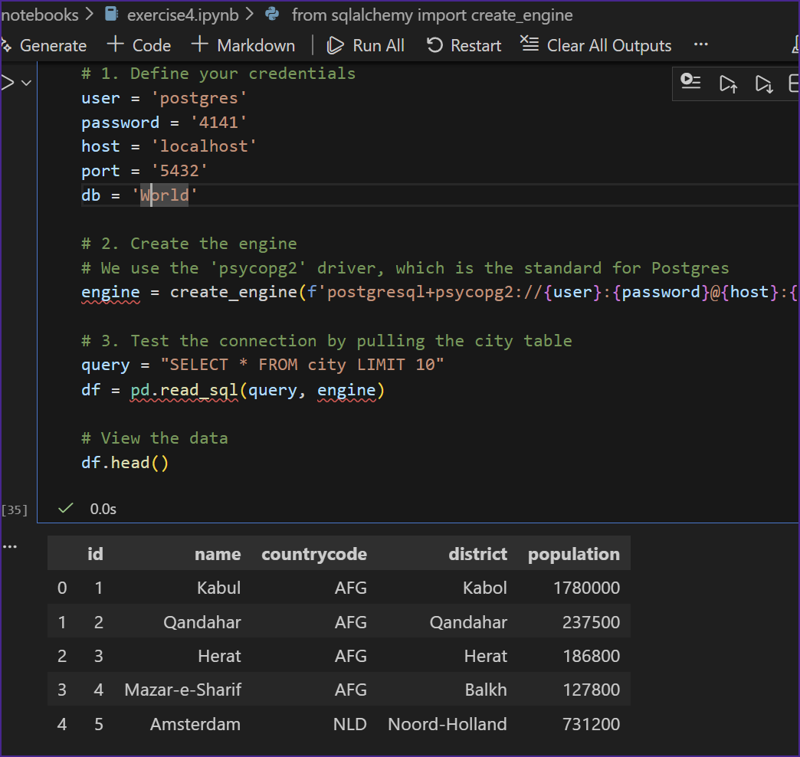
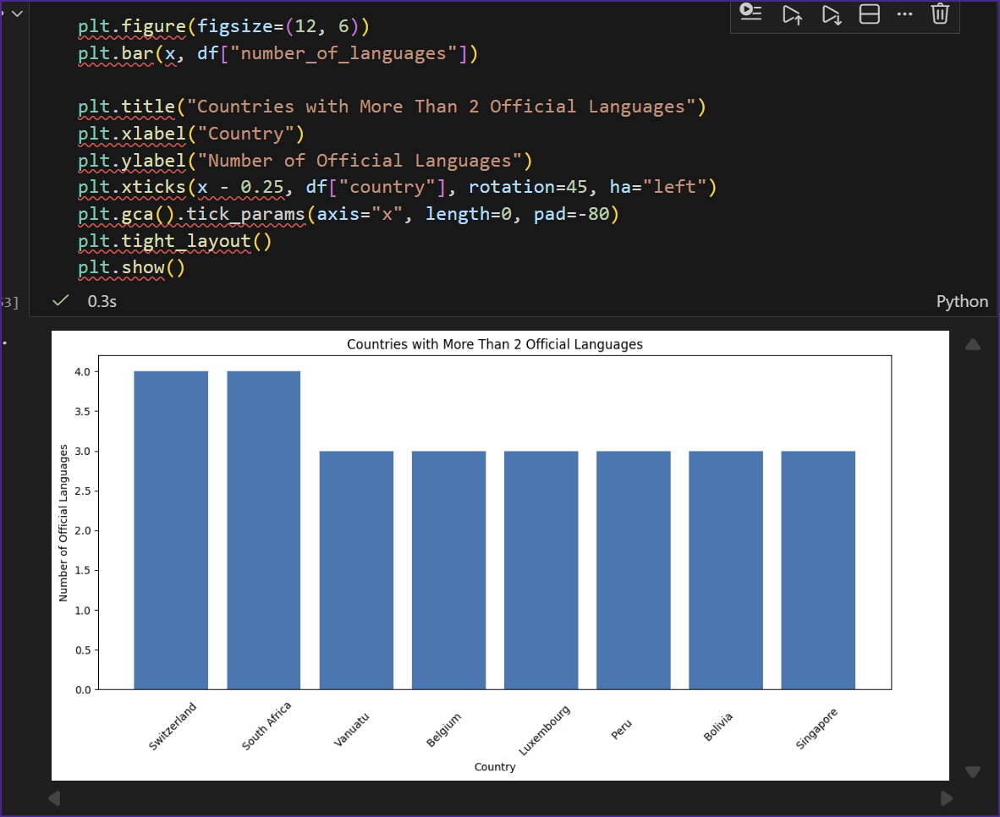

# Exercise 04: Advanced SQL, Jupyter, and Visualization

- Name: Jarred
- Course: Database for Analytics
- Module: 4
- Database Used: World Database
- Tools Used: PostgreSQL, SQLAlchemy, Pandas, Jupyter Notebooks

---

## Instructions

- Complete each task using the **World database** installed earlier.
- For SQL questions:
  - Write the SQL command in a fenced code block
  - Execute the command and include a **screenshot of the results**
- For Jupyter Notebook questions:
  - Include the required Python statements
  - Include **screenshots of the notebook output**
- Store all screenshots in the `screenshots/` folder and embed them below each question.

---

## Question 1

Considering the World database, write a SQL statement that will **display the names of countries that speak more than two official languages**, along with the **number of official languages spoken**.

- Sort the results by **number of languages**, from **most to least**.
- *Hint: There are fewer than 10 countries in the results.*

### SQL

```sql
SELECT
    c.Name AS Country_Name,
    COUNT(cl.Language) AS Official_Languages
FROM
    Country c
JOIN
    CountryLanguage cl ON c.Code = cl.CountryCode
WHERE
    cl.IsOfficial = 'T'
GROUP BY
    c.Name
HAVING
    COUNT(cl.Language) > 2
ORDER BY
    Official_Languages DESC;
```

### Screenshot


---

## Question 2

Using **Jupyter Notebooks**, you must use the `create_engine` command to connect to your database.

After the `create_engine` command is executed, **what are the three statements required to execute the query from Question 1 and display the results in the notebook**?

### Python Code

```python
query = """
SELECT
    c.name AS "Country",
    COUNT(*) AS "Number of Languages"
FROM country AS c
JOIN countrylanguage AS cl
    ON cl.countrycode = c.code
WHERE cl.isofficial = 'T'
GROUP BY c.name
HAVING COUNT(*) > 2
ORDER BY "Number of Languages" DESC;
"""
```

### Screenshot



---

## Question 3

Using **Jupyter Notebooks**, write the Python code needed to produce the following graph:


(The graph shows country-level results derived from the World database.)

### Python Code

```python
import matplotlib.pyplot as plt
import numpy as np

x = np.arange(len(df["country"]))

plt.figure(figsize=(12, 6))
plt.bar(x, df["number_of_languages"])

plt.title("Countries with More Than 2 Official Languages")
plt.xlabel("Country")
plt.ylabel("Number of Official Languages")
plt.xticks(x - 0.25, df["country"], rotation=45, ha="left")
plt.gca().tick_params(axis="x", length=0, pad=-80)
plt.tight_layout()
plt.show()
```

### Screenshot


